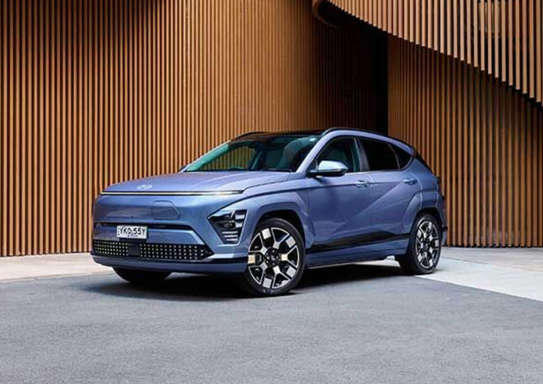

<!DOCTYPE html>
<html>
<body>
<h6 align="center"> **This is not hyundai's official home page**</h6>

<h5 align="right"> CONTACT NUMBER: (02) 8806 3607</h4>

<h2 align="left"> Indroduction </h2>

 Hyundai, founded by  South-korean enterpuneur Chung ju yung in 1967, is a well recongnised automotive manufacturer. It is worth. 60.06 trillion dollars today. It is the 5th best car manufactur and is the fastest growing automotive in Australia. Hyundai known for it's SUVs like the Palisade or there best selling model tuscon, sedans like the i30, small cars like the i20  and/or electric cars like the Ioniq 6. Hyundai is also known for it's commitment of quality, modern technoligies and sustainability in it's models. 

Now click towards the arrowrs shown to find further imformation.

  <h6 align="center"> Click towards the arrow to find more about 'Chung Ju Yung'.</h6>

 

<h6>Click towards the arrow to find all the cars Hyundai has available.</h6>

 

 
<h6> Click towards the arrow to find more about deals Hyundai has to offer you.</h6>

