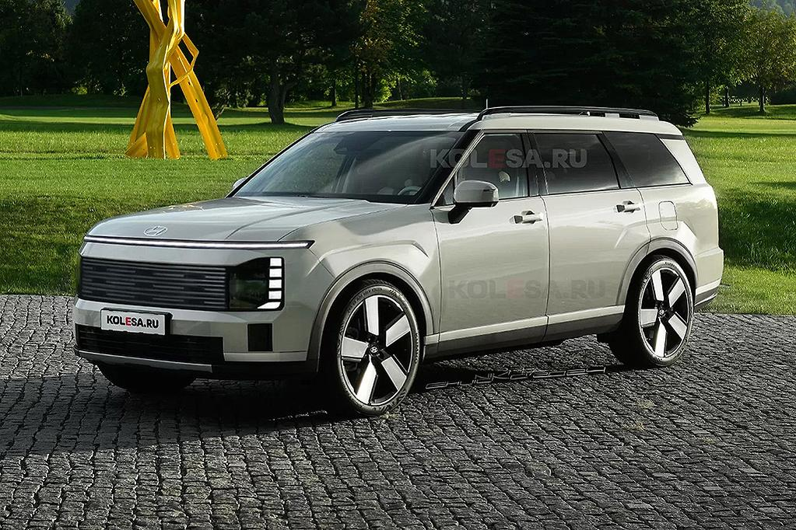

<!DOCTYPE html>
<html>
<body>

<h6 align="center"> **This is not hyundai's official home page**</h6>
<h2 align="left"> Indroduction </h2>

 Hyundai, founded by  South-korean enterpuneur Chung ju yung in 1967, is a well recongnised automotive manufacturer. It is worth. 60.06 trillion dollars today. ItI is the 5th best car manufactur is. It is the fastest growing automotive in Australia. It is known for it's SUVs like the Palisade or there best selling model tuscon, sedans like the i30, small cars like the i20  and/or electric cars like the Ioniq 6. Hyundai is also known for it's commitment of quality, modern technoligies and sustainability in it's models. 

 Click towards the arrow to find information about how hyundai started.  

  <h6 align="center"> Click towards the arrow to find more about 'Chung Ju Yung'.</h6>

